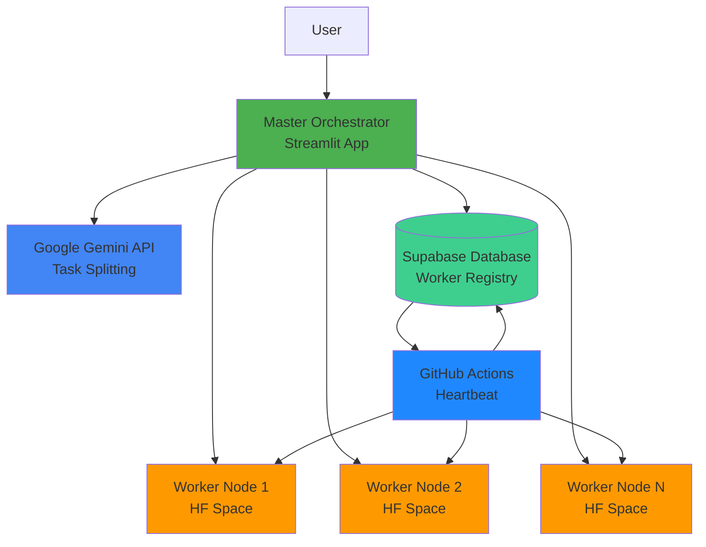
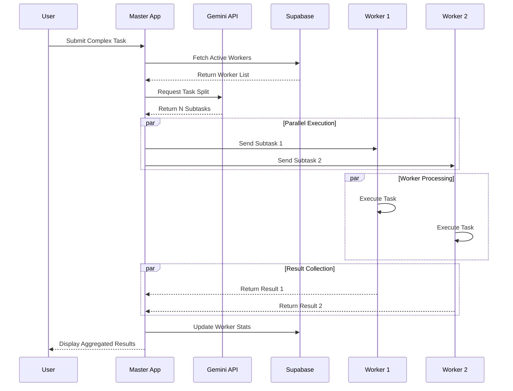
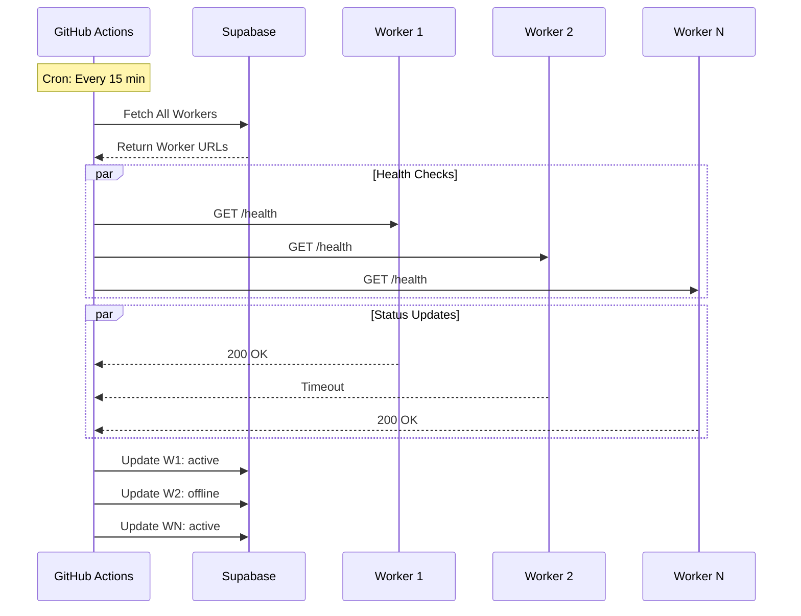

# NADG Architecture Documentation

## System Architecture

### High-Level Overview



### Task Distribution Flow



### Heartbeat Workflow



## Component Details

### 1. Master Orchestrator

**Technology:** Streamlit + Python
**Location:** `master-app/`
**Responsibilities:**
- User interface for task submission
- Integration with Gemini API for intelligent task splitting
- Worker discovery and management via Supabase
- Asynchronous task distribution
- Result aggregation and display

**Key Functions:**
```python
get_active_workers()          # Fetch workers from Supabase
split_task_with_gemini()      # AI-powered task analysis
distribute_tasks()            # Async task distribution
update_worker_task_count()    # Statistics tracking
```

### 2. Worker Node

**Technology:** FastAPI + Python
**Location:** `worker-node/`
**Deployment:** Hugging Face Spaces (Docker)
**Responsibilities:**
- Receive and execute tasks from master
- Health monitoring endpoints
- Task execution in isolated subprocess
- Return results to master

**Endpoints:**
- `GET /` - Basic status
- `GET /health` - Health check for monitoring
- `GET /status` - Detailed worker status
- `POST /execute` - Generic task execution
- `POST /execute-python` - Python-specific execution

### 3. Database (Supabase)

**Technology:** PostgreSQL (Supabase)
**Location:** Cloud
**Tables:**

**worker_nodes:**
```sql
id                SERIAL PRIMARY KEY
vm_url            TEXT UNIQUE NOT NULL
status            TEXT DEFAULT 'active'
total_tasks       INTEGER DEFAULT 0
last_ping         TIMESTAMP WITH TIME ZONE DEFAULT NOW()
```

**task_history (optional):**
```sql
id                SERIAL PRIMARY KEY
worker_id         INTEGER REFERENCES worker_nodes(id)
task_description  TEXT
status            TEXT DEFAULT 'pending'
created_at        TIMESTAMP WITH TIME ZONE DEFAULT NOW()
completed_at      TIMESTAMP WITH TIME ZONE
```

### 4. GitHub Actions Heartbeat

**Technology:** GitHub Actions + Python
**Location:** `.github/workflows/heartbeat.yml`
**Schedule:** Every 15 minutes (cron: `*/15 * * * *`)
**Responsibilities:**
- Keep workers alive (prevent Hugging Face Space sleep)
- Monitor worker health
- Update worker status in database
- Automated infrastructure maintenance

### 5. Gemini API Integration

**Provider:** Google AI Studio
**Model:** Gemini 1.5 Pro
**Purpose:** Intelligent task analysis and splitting
**Input:** User command + Number of available workers
**Output:** N optimized, independent subtasks

## Data Flow

### 1. Task Submission Flow

```
User Input
   ↓
[Master App receives task]
   ↓
[Query Supabase for active workers]
   ↓
[Send to Gemini API for analysis]
   ↓
[Receive N subtasks]
   ↓
[Distribute to N workers (async)]
   ↓
[Collect results]
   ↓
[Display to user]
```

### 2. Heartbeat Flow

```
Cron Trigger (15 min)
   ↓
[GitHub Action starts]
   ↓
[Query Supabase for all workers]
   ↓
[Ping each worker /health endpoint]
   ↓
[Update status based on response]
   ↓
[Update last_ping timestamp]
```

## Security Architecture

### Secrets Management
- **GitHub Secrets:** Store all API keys and credentials
- **Environment Variables:** Workers and master app read from env
- **No Hardcoded Secrets:** Zero credentials in source code

### API Security
```
Master App ←→ Gemini API: API Key Authentication
Master App ←→ Supabase: Service Role Key (server-side only)
Master App ←→ Workers: HTTP POST (can be enhanced with JWT)
GitHub Actions ←→ Supabase: Service Role Key
GitHub Actions ←→ Workers: Public health endpoints
```

### Worker Isolation
- Subprocess execution with timeout limits
- No direct shell access
- Resource constraints via Docker
- Limited network access

## Scalability Considerations

### Horizontal Scaling
- Add more workers by deploying additional Hugging Face Spaces
- Master app automatically discovers new workers via Supabase
- Linear scaling up to N workers

### Bottlenecks
1. **Gemini API Rate Limits:** Free tier has request limits
2. **Supabase Connections:** Free tier has connection limits
3. **Master App Compute:** Single Streamlit instance
4. **Worker Sleep:** Free Hugging Face Spaces sleep after inactivity

### Optimization Strategies
- Worker pooling and reuse
- Result caching for identical tasks
- Batch task processing
- Premium tier for production (Gemini, Supabase, HF)

## Deployment Environments

### Development
```
Master App:    Local (localhost:8501)
Workers:       Local (localhost:7860+)
Database:      Supabase (Cloud)
Gemini API:    Google AI Studio
Heartbeat:     Manual testing
```

### Production
```
Master App:    Streamlit Cloud / Cloud Run
Workers:       Hugging Face Spaces (Multiple)
Database:      Supabase Pro
Gemini API:    Google AI Studio / Vertex AI
Heartbeat:     GitHub Actions (Automated)
```

## Monitoring and Observability

### Metrics to Track
- Worker uptime percentage
- Average task execution time
- Task success/failure rate
- Worker load distribution
- API quota usage (Gemini)
- Database connection pool

### Logging
- Master App: Streamlit logs
- Workers: FastAPI uvicorn logs
- GitHub Actions: Workflow run logs
- Database: Supabase dashboard

### Alerts (Future)
- Worker offline > 30 minutes
- Task failure rate > 10%
- API quota approaching limit
- Database connection errors

## Future Architecture Enhancements

### Planned Improvements
1. **Message Queue:** Redis/RabbitMQ for task queuing
2. **Load Balancer:** Intelligent worker selection based on load
3. **Caching Layer:** Redis for result caching
4. **Auto-scaling:** Dynamic worker provisioning
5. **Observability:** Prometheus + Grafana monitoring
6. **API Gateway:** Kong/Nginx for worker traffic management

### Advanced Features
- Worker specialization (NLP, CV, Data)
- GPU worker support
- Task dependency graphs (DAG)
- Multi-tenant support
- Cost optimization algorithms
